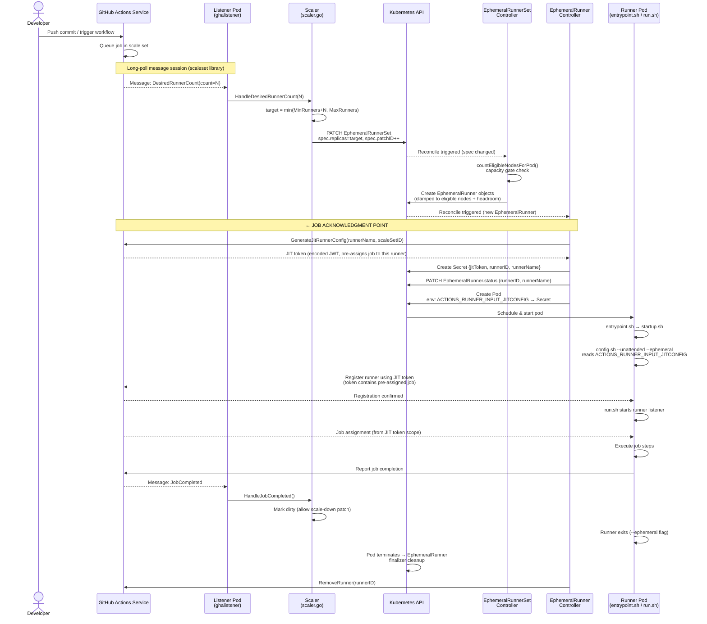

# Gate EphemeralRunner creation on schedulable node capacity

**Status**: Proposed

## Context

The modern ARC controller (`actions.github.com`) scales runners up to `MaxRunners` whenever GitHub reports queued jobs, with no check for whether the cluster can actually schedule the resulting pods. When regional GPU capacity is exhausted, the Cluster Autoscaler (CAS) fails to provision new nodes, leaving runner pods Pending indefinitely. Meanwhile, the GitHub Actions job has already been acknowledged (via `GenerateJitRunnerConfig`), so it is not re-queued — it simply times out or fails.

Observed failure mode in the `gpu1` namespace: 30 jobs were acknowledged by the controller, only 5 GPU nodes could be provisioned (GCE out-of-resources), and 25 runner pods remained Pending until GitHub's job timeout fired.

### How job acknowledgment works

The exact point at which a job is claimed from GitHub is `GenerateJitRunnerConfig()` in `ephemeralrunner_controller.go`. This API call returns a JIT (Just-in-Time) token — a short-lived JWT that pre-assigns a specific job to the named runner. Once this call succeeds, GitHub considers the job taken. If the runner pod never starts, the job is lost.



## Decision

Gate `EphemeralRunner` creation in the `EphemeralRunnerSet` controller on the number of nodes that can currently schedule the runner pod. Because no `EphemeralRunner` is created, `GenerateJitRunnerConfig` is never called, and GitHub keeps the job queued.

### Capacity check logic

Before calling `createEphemeralRunners`, count nodes that:
- Are not being deleted (`DeletionTimestamp.IsZero()`)
- Are not cordoned (`Spec.Unschedulable == false`)
- Match the pod's `RequiredDuringSchedulingIgnoredDuringExecution` node affinity terms (OR across terms, AND within each term)

Both `Ready` and `NotReady` nodes are counted. `NotReady` nodes are typically being initialised by CAS and represent capacity that will become available shortly. This prevents the chicken-and-egg problem where CAS needs a pending pod to trigger provisioning, but we would never create one because no node is ready yet.

Pods with **no required node affinity** bypass the gate entirely (the runner can land on any node; there is no meaningful node-count bound).

### `provisioningHeadroom = 1`

One additional runner beyond the current eligible node count is always allowed. This gives CAS something to react to during bootstrap (when zero nodes exist) or when there is still room to grow. Once CAS fails (e.g. GCE out of resources), no new nodes appear, the headroom is consumed, and further creation is suppressed.

```
allowed = eligibleNodeCount + 1 - currentRunners
```

### Requeue on constraint

When scale-up is suppressed or clamped, the reconciler returns `ctrl.Result{RequeueAfter: 30s}` so that newly provisioned nodes are noticed without waiting for an unrelated event.

### Why the EphemeralRunnerSet controller (not the scaler)

The scaler runs as a separate process (the listener pod) with a limited Kubernetes client. It has no informer-backed node list and would require cross-pod state sharing. The `EphemeralRunnerSet` controller already has a full cached client, a natural reconcile loop, and sits upstream of the acknowledgment point.

### Node reader

The controller manager uses a namespace-scoped cache. Nodes are cluster-scoped, so `r.List(ctx, &corev1.NodeList{})` through the cached client would fail. A dedicated `NodeReader client.Reader` field (set to `mgr.GetAPIReader()` in `SetupWithManager`) bypasses the cache and reads directly from the API server.

### RBAC

```
// +kubebuilder:rbac:groups=core,resources=nodes,verbs=get;list;watch
```

Added to `ephemeralrunnerset_controller.go` and reflected in:
- `charts/gha-runner-scale-set-controller/templates/manager_cluster_role.yaml` (cluster mode)
- `charts/gha-runner-scale-set-controller/templates/manager_single_namespace_controller_role.yaml` (single-namespace mode: separate `ClusterRole` + `ClusterRoleBinding` because nodes are cluster-scoped and cannot be granted by a namespaced `Role`)

## Consequences

**Easier:**
- Runner pods that are created will have a node to land on; Pending-forever situations caused by GPU exhaustion are eliminated.
- GitHub jobs stay queued and can be picked up later (by this cluster or another), rather than timing out.
- The `provisioningHeadroom` constant gives CAS the one pending pod it needs to bootstrap a new node pool without over-claiming.

**Harder / trade-offs:**
- Runners with no required node affinity are unaffected — the gate only applies when affinity constrains which nodes are eligible. Clusters relying solely on resource-based scheduling (no node affinity) still need a separate capacity check.
- The node count is a coarse proxy for capacity. It does not account for existing pod resource requests or per-node allocatable limits. A node that is full but not cordoned will be counted as eligible. A more precise CPU/memory-based gate is a possible follow-up.
- The 30-second requeue adds a small lag between a new node becoming available and the next batch of runners being created. In practice the listener will also patch `spec.replicas` on new job arrivals, so the effective lag is the minimum of the two.
